# 📈 DART 재무와 주식시장 통합 분석
> **기업명만 입력하면 Open DART 재무제표, 금융위원회 일별 주식시세, 원/달러 환율과 국고채 3년 금리를 수집해 핵심 지표와 비교 차트를 자동 생성하는 웹 애플리케이션**


기업의 재무제표를 직접 내려받아 계정명을 찾고 계산식을 적용하는 반복 작업을 줄이기 위해 만든 프로젝트입니다. <br>기업명을 한 개 또는 여러 개 입력하면 **일반기업, 금융업, 보험업을 자동 구분**하고, 업종에 맞는 재무지표와 차트를 보여줍니다.

---

## 🎯 프로젝트 기획 의도

*"기업마다 계정명이 다르고 업종별로 봐야 하는 지표도 다른데, 필요한 숫자를 매번 직접 찾고 계산하는 과정이 번거로웠습니다."*

이 프로젝트는 다음 흐름을 자동화하는 것을 목표로 합니다.

> **기업 검색 → DART 공시 수집 → 계정 매칭 → 업종 판별 → 재무지표 계산 → 표와 차트 생성**

- 기업명을 정확히 기억하지 못해도 유사한 상장사를 검색합니다.
- 연결재무제표를 우선 사용하고, 없으면 별도재무제표를 조회합니다.
- 업종에 적용되지 않는 지표는 억지로 계산하지 않습니다.
- 값이 없는 이유를 빈칸 대신 명확한 문구로 표시합니다.

---

## ✨ 주요 기능

| 기능 | 설명 |
|---|---|
| 🔎 유사 기업명 검색 | 공백과 법인 표기 차이, 부분 이름, 일부 오타와 영문 브랜드의 한글 발음을 보정합니다. |
| ➕ 복수 기업 입력 | `+`와 `−` 버튼으로 최대 10개 기업을 추가하거나 삭제할 수 있습니다. |
| 🏢 업종 자동 판별 | 계정 구성을 기준으로 일반기업, 금융업과 보험업을 구분합니다. |
| 📊 자동 지표 계산 | 매출, 이익, 자산, ROE, 성장률 등 업종별 핵심 지표를 계산합니다. |
| 📈 차트 생성 | 한 기업은 연도별 추세, 여러 기업은 최근 공통 연도 비교 차트를 만듭니다. |
| 🧹 맞춤형 상세표 | 조회 기업 모두에 적용되지 않는 지표 열은 웹 상세표에서 자동으로 숨깁니다. |
| 📥 CSV 다운로드 | 계산 결과 전체를 Excel에서 열 수 있는 UTF-8 BOM CSV로 제공합니다. |
| 💹 주식시장 분석 | 최근 종가, 기간 수익률, 고가와 저가, 평균 거래량과 시가총액을 계산합니다. |
| 📉 주가 비교 | 복수 기업의 첫 공통 거래일을 100으로 맞춰 동일 기간 성과를 비교합니다. |
| 💱 외부 요인(환율, 금리) | 원/달러 매매기준율과 국고채 3년 금리를 주식 거래일 기준으로 맞춰 기간 변화와 주가 수익률과의 상관계수를 계산합니다. |
| 🧽 결측치와 이상치 처리 | 빈 날은 직전 값(첫 구간은 다음 값)으로 채우고, 하루 변화가 IQR 범위 밖인 날은 지우지 않고 표시하며, 처리 내역을 로그 CSV로 남깁니다. |
| ⏳ 분석 진행 표시 | DART 재무제표, 시장 데이터, 환율과 금리, GPT 인사이트 및 결과 정리 단계를 실시간으로 표시합니다. |
| 💾 로컬 캐시 | DART 기업 고유번호는 7일간, 지난 날짜의 환율은 영구 보관해 반복 분석 시간과 API 호출 수를 줄입니다. |

### 기업명 검색 예시

```text
SK하이닉스       → SK하이닉스
에스케이하이닉스 → SK하이닉스
에스케이하닉스   → SK하이닉스
현대그린         → 현대그린푸드
삼성전짜         → 삼성전자
엘지화확         → LG화학
```

유사도가 충분히 높으면 자동 선택합니다. 비슷한 후보가 여러 개라면 임의로 결정하지 않고 후보 목록을 안내합니다.

---

## 🛠️ 분석 과정 (Workflow)

```mermaid
graph LR
    A["1. 기업명 입력"] --> B["2. DART 기업 검색"]
    B --> C["3. 연간 재무제표 수집"]
    C --> D["4. 계정 매칭과 업종 판별"]
    D --> E["5. 재무지표 계산"]
    E --> F["6. 일별 주식시세 수집과 분석"]
    F --> F2["7. 환율과 금리 수집, 거래일 정렬"]
    F2 --> F3["8. 결측 채움과 이상치 표시"]
    F3 --> G["9. 재무, 시장 및 외부 요인 KPI 계약 생성"]
    G --> H["10. GPT 구조화 인사이트 생성"]
    H --> I["11. 통합 표, CSV와 차트 생성"]
```



1. 입력된 이름을 정규화하고 Open DART 기업 고유번호 목록에서 회사를 찾습니다.
2. 최근 사업보고서의 연결재무제표(CFS)를 우선 조회합니다.
3. 표준 계정 ID를 우선 사용하고 기업별 계정명은 보조 규칙으로 매칭합니다.
4. 기업 전체 연도의 계정 구성을 바탕으로 분석 업종을 결정합니다.
5. Pandas로 비율과 성장률을 계산하고 Matplotlib으로 PNG 차트를 생성합니다.
6. 선택한 기간의 주식시세와 투자자별 거래 동향을 수집하고 시장 지표를 계산합니다.
7. 같은 기간의 원/달러 환율과 국고채 3년 금리를 수집해 주식 거래일에 맞춥니다.
8. 빈 날을 채우고 소수점 및 단위 오류를 보정하며, 하루 변화 이상치를 표시합니다.
9. 계산된 재무, 시장, 외부 요인 지표를 표준화된 KPI JSON으로 정리합니다.
10. OpenAI API 키가 있으면 KPI JSON을 바탕으로 구조화된 인사이트를 생성합니다.
11. 재무표, 시장 요약, 차트와 다운로드 파일을 하나의 결과 화면으로 구성합니다.

---

## 🧮 계산 지표

### 공통 지표

- 영업이익, 당기순이익, 총자산, 부채총계, 자본총계
- ROE, ROA, 총자산 성장률, 영업이익 성장률, 당기순이익 성장률

### 일반기업

- 매출, 영업이익률, 부채비율, 이자보상배율
- 매출 성장률, 매출채권 회전일수

### 금융업

- 순이자손익, 순수수료손익
- 분리 공시 기업은 이자와 수수료 수익에서 비용을 차감해 순액 계산

### 보험업

- 보험서비스수익, 보험서비스손익, 투자손익
- 보험서비스마진, 보험서비스수익 성장률

### 주요 계산식

```text
ROE                = 당기순이익 ÷ 평균자본 × 100
영업이익률          = 영업이익 ÷ 매출 × 100
보험서비스마진      = 보험서비스손익 ÷ 보험서비스수익 × 100
매출채권 회전일수   = 기말 매출채권 ÷ 매출 × 365
```

원천 데이터가 없거나 분모가 0이면 임의의 숫자를 만들지 않습니다. CSV에는 `해당 없음(업종)`, `비교연도 없음`, `원천 데이터 없음`처럼 이유를 표시합니다.

### 외부 요인 지표 (환율, 금리)

| KPI | 의미 |
|---|---|
| 원/달러 환율(최근), 기간 변화율 | 조회 기간 마지막 거래일 매매기준율과 첫 거래일 대비 변화율(%) |
| 국고채 3년 금리(최근), 기간 변화폭 | 마지막 거래일 금리와 첫 거래일 대비 변화폭(bp) |
| 주가 수익률-환율 / 금리 상관계수 | 일간 주가 수익률과 환율 변화율, 금리 변화폭의 상관계수 (보간한 날 제외, 20일 이상일 때만) |
| 환율, 금리 보간 거래일 | 휴장, 미고시 또는 수집 실패로 직전 값(또는 첫 구간의 다음 값)을 쓴 거래일 수 |
| 종가, 환율, 금리 하루 변화 이상치 | 하루 변화가 IQR 범위 밖으로 표시된 거래일 수 |

상관계수는 인과관계가 아닙니다. GPT 지침에도 "함께 움직이는 경향" 수준으로만 서술하고 환율과 금리의 향후 방향을 예측하지 않도록 명시되어 있습니다.

---

## 🕒 시계열 정렬과 결측치, 이상치 처리

시간 순서가 분석의 전제이므로 모든 시계열은 날짜 오름차순으로 정렬하고 순서를 섞지 않습니다.

### 기준 달력 = 주식 거래일

국내 주식, 외환 및 채권시장은 대부분 같은 날 쉬지만, 호출 실패나 제공처 공백, 해외 지표의 휴일 때문에 날짜가 어긋날 수 있습니다. 분석 대상이 주가이므로 **주가 표에 환율과 금리를 왼쪽 기준(left join)으로 붙입니다.**

```text
1일차  주가 O  환율 O  금리 O   → 그대로
2일차  주가 O  환율 X  금리 O   → 환율만 직전 값(ffill)
3일차  국내외 모두 휴일         → 주가 행이 없으므로 결과에도 없음
4일차  해외만 열림 (주가 X)     → 결과에 행을 만들지 않음
5일차  주가 O  해외 휴일        → 직전 값(ffill)
```

모든 날짜를 합치면(outer join) 주가가 없는 날이 생겨 수익률이 틀어지므로 사용하지 않습니다. 병합 후 **행 수가 주식 거래일 수와 같은지**, 날짜가 오름차순이고 중복이 없는지 검증하며 다르면 오류로 중단합니다.

### 결측 처리

| 상황 | 처리 |
|---|---|
| 휴장, 미고시 또는 수집 실패로 빈 날 | 직전 값으로 채움(ffill) — 평균으로 채우지 않음 |
| 첫 행이 빈 날 | 조회 시작일 10일 전부터 받아 둔 값으로 ffill, 그래도 없으면 다음 값(bfill) |
| 10일 넘게 관측값이 없는 중간 공백 | 오래된 값으로 채우지 않고 빈 값으로 둠 |

채운 날은 `환율보간`, `금리보간` 열과 차트의 x 마커로 구분합니다. 채운 날의 변화량은 0으로 보여 통계를 왜곡하므로 상관계수와 IQR 계산에서는 제외합니다.

### 값 대신 "얼마나 움직였나"

분석에는 수준 값보다 하루에 얼마나 움직였는지를 씁니다. `market_macro.csv`에는 수준 값과 함께 하루 변화 열이 들어갑니다.

| 대상 | 수준 값 | 하루 변화 열 | 계산 |
|---|---|---|---|
| 종가 | `종가` (원) | `종가등락률(%)` | (오늘 ÷ 어제 − 1) × 100 |
| 환율 | `원달러환율` (예: 1,385.2원) | `환율변화율(%)` | (오늘 ÷ 어제 − 1) × 100 |
| 금리 | `국고채3년` (예: 2.85%) | `금리변화폭(%p)`, `금리변화폭(bp)` | 오늘 − 어제 |

- 금리는 이미 %라서 "%의 %"를 만들지 않고 차이(변화폭)를 씁니다. 1bp = 0.01%p이므로 2.85% → 2.90%는 +0.05%p, 즉 +5bp입니다. 변화율로 계산하면 +1.75%가 되는데, 이 값은 쓰지 않습니다.
- 각 기업의 첫 거래일은 "어제"가 없어 빈 값으로 둡니다. 기업마다 따로 계산하므로 다른 기업의 값과 섞이지 않습니다.
- 직전 값으로 채운 날은 변화가 0이 되고, 다음 날에 이틀치 변화가 몰립니다. 값은 그대로 두되 `환율보간`, `금리보간` 열로 구분하고, 상관계수와 이상치 계산에서는 이 날들을 뺍니다.
- 주가 원천 데이터(`stock_prices.csv`)의 `등락률`은 거래소 기준가 대비 값입니다. `종가등락률(%)`은 조회한 거래일 순서대로 계산한 값이라, 원천 시세에 거래일이 빠져 있으면 두 값이 다를 수 있습니다.
- 결과 화면의 금리 기간 변화폭 KPI는 `+16.1bp (+0.161%p)`처럼 두 단위를 함께 표시합니다.

### 이상치 처리

값(수준) 기준으로 이상치를 지우면 추세가 있는 시계열에서는 정상 구간까지 잘려 나갑니다. 그래서 **하루 변화**(종가와 환율은 변화율, 금리는 변화폭)를 기준으로 판단합니다. 하루 변화는 0 근처에 모이므로 튀는 날만 드러납니다.

| 상황 | 처리 |
|---|---|
| 하루 변화가 `Q1 − 1.5×IQR ~ Q3 + 1.5×IQR` 밖 | 지우지 않고 `이상치` 열에 **표시**, 원인 확인 대상 |
| 소수점 및 단위 오류 (앞뒤 값 모두와 10배, 100배, 1000배 차이 후 원래 수준 복귀) | 원래 단위로 **보정**하고 로그에 원래 값과 보정 값 기록 |
| 실제로 크게 움직인 날, 수준이 바뀐 뒤 유지(예: 액면분할) | 보정하지 않고 **남김** — 그날이 분석의 핵심일 수 있음 |

- 유효한 하루 변화가 20개 미만이면 IQR이 불안정하므로 판정하지 않습니다.
- 1.5배 IQR은 정상 변동에서도 일부 날을 표시할 수 있습니다. 표시가 너무 많으면 `src/data_quality.py`의 `IQR_MULTIPLIER`를 3으로 올릴 수 있습니다.
- 모든 처리(ffill, bfill, 입력오류보정, 이상치표시)는 `data_quality_log.csv`에 대상, 기업명, 기준일, 원래값, 처리값, 사유와 함께 기록되고, 결과 화면 상단에 건수가 요약됩니다.
- `daily_change_{종목코드}.png`는 종가, 환율, 금리의 하루 변화 막대와 통상 범위(빨간 점선), 이상치(빨간 점)를 보여 줍니다. 각 패널 왼쪽 위에는 판정 결과가 항상 표시됩니다.

  | 표시 문구 | 의미 |
  |---|---|
  | `이상치 N일 (원인 확인 필요)` (빨간 글씨) | 하루 변화가 통상 범위를 벗어난 날이 N일 |
  | `이상치 0일` (회색 글씨) | 판정했지만 벗어난 날이 없음 |
  | `관측일 부족으로 판정 안 함` (회색 글씨) | 유효한 하루 변화가 20개 미만이라 판정하지 않음, 점선도 그리지 않음 |

### 리샘플링 (월별 거래량만)

분석과 이상치 판정은 모두 일별 기준입니다. 월별로 묶으면 그달 안에서 크게 출렁인 날이 값 하나로 뭉개지기 때문입니다. 예를 들어 +12%와 −11%가 섞인 달도 월간 수익률은 −1%처럼 조용해 보입니다.

리샘플링은 화면에서 실제로 읽기 어려운 곳에만 씁니다. 1년, 3년 조회에서 일별 거래량 막대가 수백 개로 빽빽해지는 문제라서, 데이터가 6개월 이상이면 `stock_volume_monthly…png`를 추가로 만듭니다. 일별 거래량 차트도 그대로 남습니다.

| 표시 | 계산 (`resample("ME")`) | 이유 |
|---|---|---|
| 막대 | 월평균 일거래량 (mean) | 시작 달, 마지막 달이나 연휴가 낀 달은 거래일이 적어 합계로 보면 거래가 줄어든 것처럼 보임 |
| 빨간 점과 선 | 그달 최대 하루 거래량 (max) | 월평균에 묻히는 하루 폭증을 놓치지 않기 위함 |
| 막대 안 숫자 | 그달 거래일 수 (count) | 일부 날짜만 포함된 달을 구분하기 위함 |

월별 상관계수는 계산하지 않습니다. 한 달은 거래일이 약 20일이라 표본 수가 약 20분의 1로 줄어들어(1년이면 12개, 3년이면 36개) 상관계수를 믿기 어렵기 때문입니다.

---
시연영상


https://github.com/user-attachments/assets/fd538833-aba5-4605-85de-0af79b1dd0b6


## 🚀 빠른 시작 (Quick Start)

### 1. 저장소 내려받기

```powershell
git clone https://github.com/David9733/financial_analysis.git
cd financial_analysis
```

### 2. API 키 설정

아래 서비스에서 API 키를 발급받은 뒤 프로젝트 루트에 `.env` 파일을 생성합니다. `.env.example`을 복사해 값만 바꿔도 됩니다.

| 키 | 발급처 | 필수 |
|---|---|---|
| `DART_KEY` | [Open DART](https://opendart.fss.or.kr/) | 필수 |
| `PUBLIC_STOCK_API_KEY` | [공공데이터포털](https://www.data.go.kr/) 금융위원회 주식시세정보 | 선택 |
| `KOREAEXIM_API_KEY` | [한국수출입은행](https://www.koreaexim.go.kr/) Open API 현재환율 | 선택 |
| `ECOS_API_KEY` | [한국은행 ECOS Open API](https://ecos.bok.or.kr/api/) | 선택 |
| `OPENAI_API_KEY` | [OpenAI](https://platform.openai.com/) | 선택 |

```text
DART_KEY=발급받은_API_키
PUBLIC_STOCK_API_KEY=공공데이터포털_서비스키
KOREAEXIM_API_KEY=수출입은행_인증키
ECOS_API_KEY=ECOS_인증키
OPENAI_API_KEY=발급받은_OpenAI_API_키
OPENAI_MODEL=gpt-4o-mini
```

주식시세 키가 없거나 일시적으로 조회에 실패해도 기존 재무분석 결과는 정상적으로 제공됩니다.
환율과 금리 키가 없거나 조회에 실패하면 경고만 표시하고 해당 외부 요인 지표를 `출처 데이터 없음`으로 둡니다. 이 경우에도 종가 하루 변화 이상치 표시는 계속 제공됩니다.
OpenAI 키가 없거나 GPT API 요청에 실패해도 계산된 KPI, 차트와 CSV는 계속 제공됩니다.
GPT 응답 검증이 실패하면 최대 3회 자동 재시도하고, 잘못된 숫자, 사용할 수 없는
근거 키, 허용되지 않는 투자 표현만 안전한 문장으로 보정합니다. 복수 기업 응답에서
일부 기업이나 비교 결과가 누락되면 계산된 KPI를 근거로 누락된 부분만 보완하고 정상
인사이트는 유지합니다.

### 3. 웹 애플리케이션 실행

이 프로젝트는 uv 관리 Python과 잠금 파일을 사용하여 시스템 패키지를 변경하지 않고 동일한 의존성 버전으로 실행할 수 있습니다.

```powershell
uv run --python 3.10 --isolated --with-requirements requirements.lock src/app.py
```

기본 설정으로 실행하면 브라우저에서 아래 주소를 엽니다.

```text
http://127.0.0.1:5000
```

호스트나 포트 설정을 변경했다면 터미널에 표시된 실제 접속 주소를 사용합니다. 종료는 터미널에서 `Ctrl+C`입니다.

결과 화면에서는 다음을 확인할 수 있습니다.

- 상단 안내: 수집 실패 경고와 `데이터 처리: 직전 값 채움 …, 하루 변화 이상치 표시 …` 요약
- KPI 카드: 재무 KPI, 시장 KPI, **외부 요인 (환율, 금리)**
- 주식시장 차트: 주가와 이동평균, 거래량, 월별 거래량(6개월 이상일 때), `macro_…`(주가와 환율, 금리), `daily_change_…`(하루 변화와 이상치)
- 다운로드: 재무 CSV, 주가 요약 및 일별 시세 CSV, **주가, 환율, 금리 CSV**, **데이터 처리 로그 CSV**

### 4. 테스트 실행

```powershell
uv run --python 3.10 --isolated --with-requirements requirements.lock --with pytest -m pytest -q
```

외부 API는 테스트에서 모두 가짜 응답으로 대체되므로 네트워크나 API 키 없이 실행됩니다.

> uv 관리 Python에서는 `python -m pip install`이 PEP 668 정책으로 차단될 수 있습니다. `--break-system-packages`로 우회하지 않고 위의 `uv run` 방식을 권장합니다.

---

## 🖥️ CLI로 실행하기

`src/main.py` 상단의 기업명과 기간을 수정합니다.

```python
COMPANIES = ["삼성전자"]
# 또는
COMPANIES = ["삼성전자", "SK하이닉스", "LG전자"]

START_YEAR = None
END_YEAR = None
NUMBER_OF_YEARS = 5
```

실행 명령:

```powershell
uv run --python 3.10 --isolated --with-requirements requirements.lock src/main.py
```

다른 Python 코드에서도 호출할 수 있습니다.

```python
from src.main import run_analysis

result = run_analysis(
    ["삼성전자", "SK하이닉스"],
    number_of_years=5,
    show_charts=False,
)
```

재무와 주식시장 데이터를 함께 사용하려면 통합 함수를 호출합니다.

```python
from src.main import run_integrated_analysis

result = run_integrated_analysis(
    ["삼성전자", "SK하이닉스"],
    number_of_years=5,
    stock_period="1y",
    show_charts=False,
)

result.market_macro   # 거래일 기준 주가, 환율, 금리와 보간 및 이상치 표시
result.quality_log    # 결측 채움, 입력 오류 보정, 이상치 표시 내역
```

---

## 📂 파일 구조

```text
financial_analysis/
├── src/
│   ├── app.py              # Flask 웹 애플리케이션과 요청 처리
│   ├── main.py             # 전체 분석 파이프라인 실행
│   ├── dart_api.py         # Open DART 통신과 유사 기업명 검색
│   ├── financial_analysis.py # 계정 선택, 업종 판별과 재무지표 계산
│   ├── visualization.py    # 단일 기업 추세와 복수 기업 비교 차트
│   ├── stock_api.py        # 금융위원회 일별 주식시세 API 통신
│   ├── stock_analysis.py   # 주가 정제, 수익률, 요약과 정규화
│   ├── stock_visualization.py # 주가, 거래량, 기업 비교, 환율과 금리, 하루 변화 차트
│   ├── investor_analysis.py # 투자자별 거래 동향 수집과 비중 계산
│   ├── macro_api.py        # 수출입은행 환율, ECOS 금리 API 통신과 환율 캐시
│   ├── macro_analysis.py   # 주식 거래일 기준 환율과 금리 병합(left join + ffill/bfill)
│   ├── data_quality.py     # 단위 오류 보정, 하루 변화 IQR 이상치 표시, 처리 로그
│   ├── kpi_analysis.py     # GPT 입력용 재무, 시장, 외부 요인 KPI 계약
│   ├── analysis_prompt.py  # 기업 재무와 시장 분석용 GPT 지침
│   └── gpt_analysis.py     # 구조화된 GPT 분석과 결과 검증
├── templates/
│   ├── index.html          # 기업 입력 화면
│   └── result.html         # 결과 차트와 상세표 화면
├── static/
│   └── style.css           # 반응형 웹 스타일
├── tests/                  # pytest 단위 및 통합 테스트(외부 API는 가짜 응답)
├── .env.example            # API 키 설정 예시
├── requirements.txt        # Python 의존성
├── requirements.lock       # 재현 가능한 전체 의존성 고정 버전
├── .gitignore              # 키, 캐시와 생성 결과 제외
└── README.md               # 프로젝트 설명
```

---

## 📤 생성 결과

```text
output/
├── cli/                    # CLI 최신 분석 결과(실행할 때 교체)
│   ├── financial_analysis.csv
│   ├── charts/
│   ├── stock_prices.csv
│   ├── stock_summary.csv
│   ├── investor_summary.csv
│   ├── market_macro.csv     # 거래일 기준 종가, 환율, 금리와 하루 변화(등락률, 변화율, 변화폭), 보간 및 이상치 표시
│   ├── data_quality_log.csv # 결측 채움, 입력 오류 보정 및 이상치 표시 내역
│   ├── stock_charts/        # macro_*.png, daily_change_*.png, stock_volume_monthly*.png 포함
│   ├── kpi_analysis.json
│   └── gpt_insights.json
└── web_runs/               # 웹 요청별 UUID 폴더
```

- 한 기업 조회: 연도별 추세 차트
- 한 기업의 단일 연도 조회: 추세선 대신 값과 수치 라벨이 있는 막대 차트
- 두 기업 이상 조회: 가장 최근 공통 연도의 기업 비교 차트
- 웹 결과: 차트 갤러리, 업종 맞춤 상세표, CSV 다운로드

웹 분석은 실행별 UUID 폴더를 사용하므로 동시에 실행해도 서로의 결과를 삭제하지
않습니다. 완료된 웹 결과는 1시간 동안 보관되며, 이후 새 분석이 완료될 때 자동
정리됩니다. 진행 중인 실행과 완료 표식이 없는 폴더는 자동 정리 대상에서 제외됩니다.

## 데이터 출처

### OpenAI API

Python/Pandas가 계산한 재무와 시장 KPI JSON만 전달해 성장성, 수익성, 재무
안정성, 시장 흐름의 자동 인사이트를 생성합니다. 일반기업뿐 아니라 금융업의
순이자손익과 수수료손익, 보험업의 보험서비스 지표도 업종에 맞게 전달합니다. GPT는
원천 숫자를 다시 계산하지 않고 사용할 KPI 키만 지정하며, 화면에 표시되는 근거
값은 Python이 원본 KPI에서 조합합니다. 데이터가 없는 값은 추정하지 않습니다.

복수 기업은 주요 KPI 차이를 함께 설명하지만 종합점수나 종목 순위를 만들지
않습니다. 결과는 투자 추천이나 미래 주가 예측이 아닌 추가 검토용 참고사항입니다.
API 호출에는 Responses API의 구조화 출력을 사용하며 응답 저장을 비활성화합니다.

GPT 입력에는 최근 재무연도별 KPI 이력과 실제 주가 조회 시작일, 최신 기준일이
포함됩니다. 출력은 한줄 요약, 데이터 기준, 성장성, 수익성, 재무 안정성, 효율성,
시장 흐름, KPI 관계와 불일치, 긍정 및 주의 데이터, 추가 확인사항과 종합 분석으로
구조화됩니다. 각 판단의 근거 값은 GPT가 다시 작성하지 않고 KPI 키를 통해 원본
계산 결과와 연결됩니다.

단일 기업과 복수 기업 모두 같은 검증 절차를 사용합니다. 검증에 실패한 응답은 최대
3회 다시 요청합니다. 이후에도 문제가 남으면 입력 KPI에 없는 숫자, 사용할 수 없는
근거 키, 투자 권유 표현이 포함된 문장만 안전한 요약으로 교체합니다. 모델이 일부
기업을 누락한 경우에는 해당 기업의 계산된 KPI로 최소 인사이트를 구성하며, 이미
검증을 통과한 다른 기업의 인사이트는 폐기하지 않습니다. 복수 기업 비교가 누락되거나
잘못된 경우에는 모든 기업에서 사용할 수 있는 공통 KPI를 근거로 비교 항목을
구성합니다.

`.env`에는 다음 항목을 추가합니다. 기존 `GPT_KEY`도 호환되지만
`OPENAI_API_KEY` 사용을 권장합니다.

```text
OPENAI_API_KEY=발급받은_OpenAI_API_키
OPENAI_MODEL=gpt-4o-mini
```

GPT API 인증, 요청 제한, 연결 또는 타임아웃으로 분석을 생성하지 못해도 기존 DART와
주가 KPI, 차트는 정상적으로 표시됩니다. 응답 내용 검증 실패는 위 재시도와 부분 복구
절차로 처리합니다.

### Open DART

기업 기본정보, 상장 종목코드와 연간 재무제표를 사용합니다.

### 공공데이터포털 금융위원회 주식시세

한국거래소 상장 주식의 일별 시가, 고가, 저가, 종가, 거래량, 거래대금과 시가총액을 사용합니다. 데이터는 일 1회 적재되므로 화면의 최근 종가는 당일 실시간 체결가가 아니라 표시된 최신 거래일 기준입니다.

### 한국수출입은행 현재환율 (원/달러)

`exchangeJSON` 1회 요청은 날짜 1개의 모든 통화를 반환하므로, 응답에서 `cur_unit = USD` 행의 매매기준율(`deal_bas_r`)만 사용하고 조회 기간의 날짜 수만큼 호출합니다.

- 주말은 호출하지 않으며, 공휴일은 빈 응답이므로 값 없음으로 처리합니다.
- 당일 값은 평일 11시 이후 갱신되므로 캐시하지 않습니다.
- 금액은 `"1,358.4"`처럼 쉼표가 포함된 문자열이라 숫자로 변환합니다.
- 일일 호출 한도는 1,000건입니다. 지난 날짜 결과는 `.cache/exim_usd_krw.json`에 영구 보관하므로 같은 기간은 다시 호출하지 않습니다. 처음 3년을 조회하면 약 780건을 호출하므로 같은 날 다른 신규 기간 조회에 주의합니다.
- 날짜별 일시 오류는 최대 3회 재시도하고, 그래도 실패한 날은 경고 후 직전 값으로 채웁니다. 인증 오류나 한도 초과는 남은 호출을 즉시 중단합니다.

### 한국은행 ECOS (국고채 3년)

`StatisticSearch`로 통계표 `817Y002`(시장금리 일별), 항목 `010200000`(국고채 3년)을 조회 기간 전체에 대해 한 번에 요청합니다. `TIME`(YYYYMMDD)과 `DATA_VALUE`를 사용하며, 한 번에 1,000행을 넘으면 페이지를 나눠 받습니다. 결과가 비면(`INFO-200`) 기간 또는 통계표와 항목 코드를 확인하라는 경고를 표시합니다.

### 투자자별 거래 동향

공개 종목 동향에서 최근 최대 10거래일의 투자자별 거래실적을 조회하고 기관, 개인, 외국인과 기타의 누적 매수 거래량 비중을 계산합니다. ‘기타’는 전체 거래량에서 기관, 개인과 외국인 거래량을 뺀 값입니다. 거래량 차트의 빨강(종가가 시가 이상)과 파랑(종가가 시가 미만)은 실제 매수와 매도 거래량 분리가 아니라 일중 가격 방향에 따른 우세 표시입니다. 모든 체결에는 매수자와 매도자가 동시에 존재하므로 전체 거래량 자체를 매수량과 매도량으로 나눌 수는 없습니다.

---

## 🔒 보안 및 데이터 처리

- `.env`와 DART API 키는 Git 추적 대상에서 제외됩니다.
- 웹 서버는 기본적으로 `127.0.0.1`에만 열리며 `debug=False`로 실행됩니다.
- 사용자 입력을 셸 명령으로 실행하지 않습니다.
- 생성된 CSV와 차트는 로컬 `output/` 폴더에 저장되며 GitHub에 업로드되지 않습니다.
- Windows에서는 `C:\Windows\Fonts\malgun.ttf`를 우선 등록해 차트의 한글 깨짐을 방지하고, 다른 운영체제에서는 설치된 한글 글꼴을 자동으로 찾습니다.
- DART 기업코드 캐시는 `.cache/corp_codes.json`에 저장되고 7일 후 자동 갱신되며 Git 추적에서 제외됩니다.
- 기업 검색과 재무제표 수집을 위해 DART 키가 Open DART 서버로 전송되며, 주식시세 수집을 위해 종목코드와 공공데이터포털 키가 공공데이터포털 서버로 전송됩니다.
- 환율과 금리 수집 시 조회 날짜와 각 인증키만 한국수출입은행과 한국은행 ECOS 서버로 전송되며 기업 정보는 전송하지 않습니다. 환율 캐시(`.cache/exim_usd_krw.json`)도 Git 추적에서 제외됩니다.
- GPT 분석을 사용할 때 기업명과 계산된 KPI JSON이 OpenAI API로 전송되며 API 키는 전송 데이터나 로그에 포함하지 않습니다.

> 현재 구성은 개인 PC의 로컬 사용을 기준으로 합니다. 인터넷에 공개 배포하려면 사용자 인증, 요청 제한, HTTPS, 운영용 WSGI 서버와 결과 파일 정리 정책을 추가해야 합니다.

## 운영 로그와 문제 확인

웹 실행 터미널에는 API 키나 전체 KPI 원문 대신 분석 실행 ID(`run_id`), 현재 단계,
기업 수, 경고 수와 처리시간을 기록합니다. GPT 분석 실패도 인증, 요청 제한, 타임아웃과
응답 검증 단계로 구분된 안전한 오류 문구와 함께 남습니다. 화면에서 분석이 중단되면
터미널의 같은 `run_id` 로그를 확인하면 실패 단계를 찾을 수 있습니다.

`requirements.txt`는 호환 가능한 주 버전 범위를 정의하고 `requirements.lock`은 검증된
정확한 버전을 고정합니다. 라이브러리를 갱신한 경우 전체 테스트를 통과한 뒤 다음
명령으로 잠금 파일을 다시 생성합니다.

```powershell
uv pip compile --python-version 3.10 requirements.txt -o requirements.lock
```

---

## ⚠️ 참고 사항

- Open DART에서 제공하지 않는 연도나 계정은 분석 결과에도 표시할 수 없습니다.
- 기업별 사용자 정의 계정명 때문에 일부 지표가 `원천 데이터 없음`으로 표시될 수 있습니다.
- 유사 검색은 잘못된 기업 선택을 막기 위해 확신도가 낮을 때 자동 선택하지 않습니다.
- 이상치 표시는 "통상 범위를 벗어난 하루"라는 뜻일 뿐 오류나 사건을 단정하지 않습니다. 표시된 날짜는 `data_quality_log.csv`를 보고 공시나 뉴스 등으로 원인을 확인해야 합니다.
- 원천 시세에 거래일이 빠져 있으면 그 기간의 변화가 하루에 몰려 큰 변화로 보일 수 있습니다.
- OpenAI 프로젝트의 지출 한도를 초과하면 GPT 인사이트 없이 나머지 결과만 표시됩니다.
- 시장지수(KOSPI, KOSDAQ)와 업종지수는 수집하지 않습니다. 업종지수는 기업마다 대응하는 지수가 달라 업종 분류 연결과 예외 처리가 커지므로 제외했습니다. 시장 대비 비교가 필요해지면 주가 데이터의 `시장구분`을 이용해 시장지수부터 추가할 수 있습니다.
- 재무지표는 투자 권유가 아닌 공시 데이터 탐색과 비교를 위한 참고 자료입니다.
