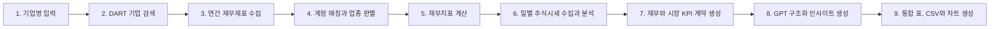

# 📈 DART 재무와 주식시장 통합 분석
> **기업명만 입력하면 Open DART 재무제표와 금융위원회 일별 주식시세를 수집해 핵심 지표와 비교 차트를 자동 생성하는 웹 애플리케이션**


기업의 재무제표를 직접 내려받아 계정명을 찾고 계산식을 적용하는 반복 작업을 줄이기 위해 만든 프로젝트입니다. <br>기업명을 한 개 또는 여러 개 입력하면 **일반기업, 금융업, 보험업을 자동 구분**하고, 업종에 맞는 재무지표와 차트를 보여줍니다.

---

## 🎯 프로젝트 기획 의도

*"기업마다 계정명이 다르고 업종별로 봐야 하는 지표도 다른데, 필요한 숫자를 매번 직접 찾고 계산하는 과정이 번거로웠습니다."*

이 프로젝트는 다음 흐름을 자동화하는 것을 목표로 합니다.

> **기업 검색 → DART 공시 수집 → 계정 매칭 → 업종 판별 → 재무지표 계산 → 표와 차트 생성**

- 기업명을 정확히 기억하지 못해도 유사한 상장사를 검색합니다.
- 연결재무제표를 우선 사용하고, 없으면 별도재무제표를 조회합니다.
- 업종에 적용되지 않는 지표는 억지로 계산하지 않습니다.
- 값이 없는 이유를 빈칸 대신 명확한 문구로 표시합니다.

---

## ✨ 주요 기능

| 기능 | 설명 |
|---|---|
| 🔎 유사 기업명 검색 | 공백과 법인 표기 차이, 부분 이름, 일부 오타와 영문 브랜드의 한글 발음을 보정합니다. |
| ➕ 복수 기업 입력 | `+`와 `−` 버튼으로 최대 10개 기업을 추가하거나 삭제할 수 있습니다. |
| 🏢 업종 자동 판별 | 계정 구성을 기준으로 일반기업, 금융업과 보험업을 구분합니다. |
| 📊 자동 지표 계산 | 매출, 이익, 자산, ROE, 성장률 등 업종별 핵심 지표를 계산합니다. |
| 📈 차트 생성 | 한 기업은 연도별 추세, 여러 기업은 최근 공통 연도 비교 차트를 만듭니다. |
| 🧹 맞춤형 상세표 | 조회 기업 모두에 적용되지 않는 지표 열은 웹 상세표에서 자동으로 숨깁니다. |
| 📥 CSV 다운로드 | 계산 결과 전체를 Excel에서 열 수 있는 UTF-8 BOM CSV로 제공합니다. |
| 💹 주식시장 분석 | 최근 종가, 기간 수익률, 고가와 저가, 평균 거래량과 시가총액을 계산합니다. |
| 📉 주가 비교 | 복수 기업의 첫 공통 거래일을 100으로 맞춰 동일 기간 성과를 비교합니다. |
| ⏳ 분석 진행 표시 | DART 재무제표, 시장 데이터, GPT 인사이트와 결과 정리 단계를 실시간으로 표시합니다. |
| 💾 기업코드 캐시 | DART 기업 고유번호를 7일간 로컬에 보관해 반복 분석 시작 시간을 줄입니다. |

### 기업명 검색 예시

```text
SK하이닉스       → SK하이닉스
에스케이하이닉스 → SK하이닉스
에스케이하닉스   → SK하이닉스
현대그린         → 현대그린푸드
삼성전짜         → 삼성전자
엘지화확         → LG화학
```

유사도가 충분히 높으면 자동 선택합니다. 비슷한 후보가 여러 개라면 임의로 결정하지 않고 후보 목록을 안내합니다.

---

## 🛠️ 분석 과정 (Workflow)



1. 입력된 이름을 정규화하고 Open DART 기업 고유번호 목록에서 회사를 찾습니다.
2. 최근 사업보고서의 연결재무제표(CFS)를 우선 조회합니다.
3. 표준 계정 ID를 우선 사용하고 기업별 계정명은 보조 규칙으로 매칭합니다.
4. 기업 전체 연도의 계정 구성을 바탕으로 분석 업종을 결정합니다.
5. Pandas로 비율과 성장률을 계산하고 Matplotlib으로 PNG 차트를 생성합니다.
6. 선택한 기간의 주식시세와 투자자별 거래 동향을 수집하고 시장 지표를 계산합니다.
7. 계산된 재무와 시장 지표를 표준화된 KPI JSON으로 정리합니다.
8. OpenAI API 키가 있으면 KPI JSON을 바탕으로 구조화된 인사이트를 생성합니다.
9. 재무표, 시장 요약, 차트와 다운로드 파일을 하나의 결과 화면으로 구성합니다.

---

## 🧮 계산 지표

### 공통 지표

- 영업이익, 당기순이익, 총자산, 부채총계, 자본총계
- ROE, ROA, 총자산 성장률, 영업이익 성장률, 당기순이익 성장률

### 일반기업

- 매출, 영업이익률, 부채비율, 이자보상배율
- 매출 성장률, 매출채권 회전일수

### 금융업

- 순이자손익, 순수수료손익
- 분리 공시 기업은 이자와 수수료 수익에서 비용을 차감해 순액 계산

### 보험업

- 보험서비스수익, 보험서비스손익, 투자손익
- 보험서비스마진, 보험서비스수익 성장률

### 주요 계산식

```text
ROE                = 당기순이익 ÷ 평균자본 × 100
영업이익률          = 영업이익 ÷ 매출 × 100
보험서비스마진      = 보험서비스손익 ÷ 보험서비스수익 × 100
매출채권 회전일수   = 기말 매출채권 ÷ 매출 × 365
```

원천 데이터가 없거나 분모가 0이면 임의의 숫자를 만들지 않습니다. CSV에는 `해당 없음(업종)`, `비교연도 없음`, `원천 데이터 없음`처럼 이유를 표시합니다.

---

## 🚀 빠른 시작 (Quick Start)

### 1. 저장소 내려받기

```powershell
git clone https://github.com/David9733/financial_analysis.git
cd financial_analysis
```

### 2. API 키 설정

[Open DART](https://opendart.fss.or.kr/)와 공공데이터포털에서 API 키를 발급받은 뒤 프로젝트 루트에 `.env` 파일을 생성합니다.

```text
DART_KEY=발급받은_API_키
PUBLIC_STOCK_API_KEY=공공데이터포털_서비스키
OPENAI_API_KEY=발급받은_OpenAI_API_키
OPENAI_MODEL=gpt-4o-mini
```

주식시세 키가 없거나 일시적으로 조회에 실패해도 기존 재무분석 결과는 정상적으로 제공됩니다.
OpenAI 키가 없거나 GPT 응답 검증에 실패해도 계산된 KPI, 차트와 CSV는 계속 제공됩니다.

### 3. 웹 애플리케이션 실행

이 프로젝트는 uv 관리 Python과 잠금 파일을 사용하여 시스템 패키지를 변경하지 않고 동일한 의존성 버전으로 실행할 수 있습니다.

```powershell
uv run --python 3.10 --isolated --with-requirements requirements.lock src/app.py
```

기본 설정으로 실행하면 브라우저에서 아래 주소를 엽니다.

```text
http://127.0.0.1:5000
```

호스트나 포트 설정을 변경했다면 터미널에 표시된 실제 접속 주소를 사용합니다.

> uv 관리 Python에서는 `python -m pip install`이 PEP 668 정책으로 차단될 수 있습니다. `--break-system-packages`로 우회하지 않고 위의 `uv run` 방식을 권장합니다.

---

## 🖥️ CLI로 실행하기

`src/main.py` 상단의 기업명과 기간을 수정합니다.

```python
COMPANIES = ["삼성전자"]
# 또는
COMPANIES = ["삼성전자", "SK하이닉스", "LG전자"]

START_YEAR = None
END_YEAR = None
NUMBER_OF_YEARS = 5
```

실행 명령:

```powershell
uv run --python 3.10 --isolated --with-requirements requirements.txt src/main.py
```

다른 Python 코드에서도 호출할 수 있습니다.

```python
from src.main import run_analysis

result = run_analysis(
    ["삼성전자", "SK하이닉스"],
    number_of_years=5,
    show_charts=False,
)
```

재무와 주식시장 데이터를 함께 사용하려면 통합 함수를 호출합니다.

```python
from src.main import run_integrated_analysis

result = run_integrated_analysis(
    ["삼성전자", "SK하이닉스"],
    number_of_years=5,
    stock_period="1y",
    show_charts=False,
)
```

---

## 📂 파일 구조

```text
financial_analysis/
├── src/
│   ├── app.py              # Flask 웹 애플리케이션과 요청 처리
│   ├── main.py             # 전체 분석 파이프라인 실행
│   ├── dart_api.py         # Open DART 통신과 유사 기업명 검색
│   ├── financial_analysis.py # 계정 선택, 업종 판별과 재무지표 계산
│   ├── visualization.py    # 단일 기업 추세와 복수 기업 비교 차트
│   ├── stock_api.py        # 금융위원회 일별 주식시세 API 통신
│   ├── stock_analysis.py   # 주가 정제, 수익률, 요약과 정규화
│   ├── stock_visualization.py # 주가, 거래량과 기업 비교 차트
│   ├── kpi_analysis.py     # GPT 입력용 재무와 시장 KPI 계약
│   ├── analysis_prompt.py  # 기업 재무와 시장 분석용 GPT 지침
│   └── gpt_analysis.py     # 구조화된 GPT 분석과 결과 검증
├── templates/
│   ├── index.html          # 기업 입력 화면
│   └── result.html         # 결과 차트와 상세표 화면
├── static/
│   └── style.css           # 반응형 웹 스타일
├── requirements.txt        # Python 의존성
├── requirements.lock       # 재현 가능한 전체 의존성 고정 버전
├── .gitignore              # 키, 캐시와 생성 결과 제외
└── README.md               # 프로젝트 설명
```

---

## 📤 생성 결과

```text
output/
├── cli/                    # CLI 최신 분석 결과(실행할 때 교체)
│   ├── financial_analysis.csv
│   ├── charts/
│   ├── stock_prices.csv
│   ├── stock_summary.csv
│   ├── investor_summary.csv
│   ├── stock_charts/
│   ├── kpi_analysis.json
│   └── gpt_insights.json
└── web_runs/               # 웹 요청별 UUID 폴더
```

- 한 기업 조회: 연도별 추세 차트
- 한 기업의 단일 연도 조회: 추세선 대신 값과 수치 라벨이 있는 막대 차트
- 두 기업 이상 조회: 가장 최근 공통 연도의 기업 비교 차트
- 웹 결과: 차트 갤러리, 업종 맞춤 상세표, CSV 다운로드

웹 분석은 실행별 UUID 폴더를 사용하므로 동시에 실행해도 서로의 결과를 삭제하지
않습니다. 완료된 웹 결과는 1시간 동안 보관되며, 이후 새 분석이 완료될 때 자동
정리됩니다. 진행 중인 실행과 완료 표식이 없는 폴더는 자동 정리 대상에서 제외됩니다.

## 데이터 출처

### OpenAI API

Python/Pandas가 계산한 재무와 시장 KPI JSON만 전달해 성장성, 수익성, 재무
안정성, 시장 흐름의 자동 인사이트를 생성합니다. 일반기업뿐 아니라 금융업의
순이자손익과 수수료손익, 보험업의 보험서비스 지표도 업종에 맞게 전달합니다. GPT는
원천 숫자를 다시 계산하지 않고 사용할 KPI 키만 지정하며, 화면에 표시되는 근거
값은 Python이 원본 KPI에서 조합합니다. 데이터가 없는 값은 추정하지 않습니다.

복수 기업은 주요 KPI 차이를 함께 설명하지만 종합점수나 종목 순위를 만들지
않습니다. 결과는 투자 추천이나 미래 주가 예측이 아닌 추가 검토용 참고사항입니다.
API 호출에는 Responses API의 구조화 출력을 사용하며 응답 저장을 비활성화합니다.

GPT 입력에는 최근 재무연도별 KPI 이력과 실제 주가 조회 시작일, 최신 기준일이
포함됩니다. 출력은 한줄 요약, 데이터 기준, 성장성, 수익성, 재무 안정성, 효율성,
시장 흐름, KPI 관계와 불일치, 긍정 및 주의 데이터, 추가 확인사항과 종합 분석으로
구조화됩니다. 각 판단의 근거 값은 GPT가 다시 작성하지 않고 KPI 키를 통해 원본
계산 결과와 연결됩니다.

`.env`에는 다음 항목을 추가합니다. 기존 `GPT_KEY`도 호환되지만
`OPENAI_API_KEY` 사용을 권장합니다.

```text
OPENAI_API_KEY=발급받은_OpenAI_API_키
OPENAI_MODEL=gpt-4o-mini
```

GPT API 인증, 요청 제한, 연결, 타임아웃 또는 응답 검증이 실패해도 기존
DART와 주가 KPI, 차트는 정상적으로 표시됩니다.

### Open DART

기업 기본정보, 상장 종목코드와 연간 재무제표를 사용합니다.

### 공공데이터포털 금융위원회 주식시세

한국거래소 상장 주식의 일별 시가, 고가, 저가, 종가, 거래량, 거래대금과 시가총액을 사용합니다. 데이터는 일 1회 적재되므로 화면의 최근 종가는 당일 실시간 체결가가 아니라 표시된 최신 거래일 기준입니다.

### 투자자별 거래 동향

공개 종목 동향에서 최근 최대 10거래일의 투자자별 거래실적을 조회하고 기관, 개인, 외국인과 기타의 누적 매수 거래량 비중을 계산합니다. ‘기타’는 전체 거래량에서 기관, 개인과 외국인 거래량을 뺀 값입니다. 거래량 차트의 빨강(종가가 시가 이상)과 파랑(종가가 시가 미만)은 실제 매수와 매도 거래량 분리가 아니라 일중 가격 방향에 따른 우세 표시입니다. 모든 체결에는 매수자와 매도자가 동시에 존재하므로 전체 거래량 자체를 매수량과 매도량으로 나눌 수는 없습니다.

---

## 🔒 보안 및 데이터 처리

- `.env`와 DART API 키는 Git 추적 대상에서 제외됩니다.
- 웹 서버는 기본적으로 `127.0.0.1`에만 열리며 `debug=False`로 실행됩니다.
- 사용자 입력을 셸 명령으로 실행하지 않습니다.
- 생성된 CSV와 차트는 로컬 `output/` 폴더에 저장되며 GitHub에 업로드되지 않습니다.
- Windows에서는 `C:\Windows\Fonts\malgun.ttf`를 우선 등록해 차트의 한글 깨짐을 방지하고, 다른 운영체제에서는 설치된 한글 글꼴을 자동으로 찾습니다.
- DART 기업코드 캐시는 `.cache/corp_codes.json`에 저장되고 7일 후 자동 갱신되며 Git 추적에서 제외됩니다.
- 기업 검색과 재무제표 수집을 위해 DART 키가 Open DART 서버로 전송되며, 주식시세 수집을 위해 종목코드와 공공데이터포털 키가 공공데이터포털 서버로 전송됩니다.
- GPT 분석을 사용할 때 기업명과 계산된 KPI JSON이 OpenAI API로 전송되며 API 키는 전송 데이터나 로그에 포함하지 않습니다.

> 현재 구성은 개인 PC의 로컬 사용을 기준으로 합니다. 인터넷에 공개 배포하려면 사용자 인증, 요청 제한, HTTPS, 운영용 WSGI 서버와 결과 파일 정리 정책을 추가해야 합니다.

## 운영 로그와 문제 확인

웹 실행 터미널에는 API 키나 전체 KPI 원문 대신 분석 실행 ID(`run_id`), 현재 단계,
기업 수, 경고 수와 처리시간을 기록합니다. GPT 분석 실패도 인증, 요청 제한, 타임아웃과
응답 검증 단계로 구분된 안전한 오류 문구와 함께 남습니다. 화면에서 분석이 중단되면
터미널의 같은 `run_id` 로그를 확인하면 실패 단계를 찾을 수 있습니다.

`requirements.txt`는 호환 가능한 주 버전 범위를 정의하고 `requirements.lock`은 검증된
정확한 버전을 고정합니다. 라이브러리를 갱신한 경우 전체 테스트를 통과한 뒤 다음
명령으로 잠금 파일을 다시 생성합니다.

```powershell
uv pip compile --python-version 3.10 requirements.txt -o requirements.lock
```

---

## ⚠️ 참고 사항

- Open DART에서 제공하지 않는 연도나 계정은 분석 결과에도 표시할 수 없습니다.
- 기업별 사용자 정의 계정명 때문에 일부 지표가 `원천 데이터 없음`으로 표시될 수 있습니다.
- 유사 검색은 잘못된 기업 선택을 막기 위해 확신도가 낮을 때 자동 선택하지 않습니다.
- 재무지표는 투자 권유가 아닌 공시 데이터 탐색과 비교를 위한 참고 자료입니다.
